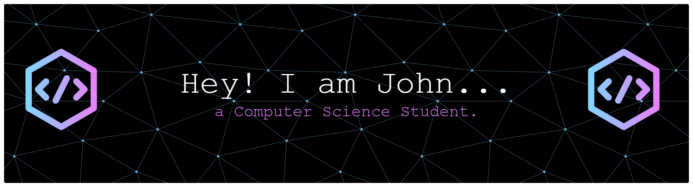

# My GitHub Profile

##  Hi there 👋 Welcome to my profile!

 
  
Visitor count

  

<h1 align="center">
  
</h1>

### A Computer Science student passionate about building beautiful, functional, and user-centric web applications.

- 🌱 I’m currently learning **[JavaScript](https://www.freecodecamp.org/news/learn-javascript-free-js-courses-for-beginners/)**
-  💬 Ask me about **HTML, CSS, Tailwind, Javascript, PHP, MySql, Comsci stuff...or anything [here](https://github.com/aljnmusic/aljnmusic/issues)**

<!--

-->

<!--
**aljnmusic/aljnmusic** is a ✨ _special_ ✨ repository because its `README.md` (this file) appears on your GitHub profile.

Here are some ideas to get you started:

- 🔭 I’m currently working on ...
- 🌱 I’m currently learning ...
- 👯 I’m looking to collaborate on ...
- 🤔 I’m looking for help with ...
- 💬 Ask me about ...
- 📫 How to reach me: ...
- 😄 Pronouns: ...
- ⚡ Fun fact: ...
-->
